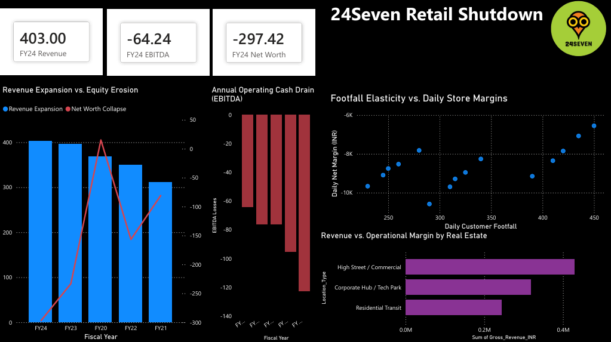

# 24Seven-Retail-Shutdown-Analysis
A financial and strategic case study which aims to analyze the retail footprint shutdown of 24Seven India using Power BI dashboard models.

# The Financial Reality Behind the 24Seven Retail Shutdown

This project is a detailed look into why the famous 24Seven convenience store chain in India had to shut down its business. By using real corporate numbers and daily store data inside Power BI, this study breaks down the hidden business problems that forced a massive retail brand to close its doors.

---

## Introduction to 24Seven India

The 24Seven retail chain was started by Godfrey Phillips India, which is a massive tobacco and manufacturing company. When it first launched in the Delhi-NCR region, it was a completely fresh and exciting idea for Indian consumers. The store offered something people had never seen before: modern, brightly lit, clean shops that stayed open 24 hours a day, 7 days a week.

The main goal was to catch impulse buyers, midnight snackers, and night-shift corporate workers. If you needed milk, a quick meal, or basic groceries at 3:00 AM, 24Seven was the only reliable place to go. For the parent company, it was a way to diversify away from cigarettes and build a massive retail brand that directly connected with daily shoppers. Over the years, they expanded to over 140 locations across Delhi, Punjab, and Telangana, becoming a regular part of urban college and corporate life.

---

## The Downfall of 24Seven

On the surface, 24Seven looked incredibly successful because the stores were always busy. However, behind the scenes, a financial disaster was brewing. In business, making a lot of sales does not mean you are making a profit. The core issue was that the cost of running a round-the-clock physical store in India is incredibly high.

The company entered a dangerous trap where its revenues were growing every year, but its losses were growing even faster. By the time they reached their final year of operations, the retail division had racked up massive negative numbers that completely wiped out its capital.

There were two main reasons for this collapse:
* **Broken Internal Unit Economics:** The profit margins on snacks and groceries are very thin, but the daily costs to keep a physical store running non-stop are fixed and unforgiving.
* **The Rise of Quick Commerce:** A massive external shock hit the market with the sudden rise of apps like Blinkit and Zepto. These apps changed the meaning of convenience. Instead of walking down the street to a 24Seven at midnight, people started ordering from their phones and getting delivery in 10 minutes. Quick-commerce companies use dark stores, which are just basic warehouses hidden in cheap side alleys. They do not pay expensive high-street rents, they do not need fancy lighting or interior designs, and they do not need to hire customer-facing floor staff.

Because their costs were so low, they could easily steal 24Seven's core customers. Trapped between rising real estate bills and dropping customer numbers, 24Seven was losing crores of rupees every month. Eventually, the board of directors stepped in and voted to shut down the entire retail operation to save the parent company from going bankrupt.

---

## What the Power BI Dashboard Explains

The dashboard built for this project acts as a financial diagnostic tool. It breaks down the raw data to prove exactly why the business model failed. Below is the full interface visual followed by the critical findings we can derive directly from the charts.

### The Corporate Financial Cards and Divergence Trend
At the top left of the dashboard, the final corporate metrics for the closing year tell a shocking story. The revenue card shows a massive **403 Crore**, which proves that people were still buying things from 24Seven. However, the next card shows an EBITDA loss of **minus 64.24 Crore**. This means that before even counting taxes or interest, the basic day-to-day operations were losing money. Because they kept losing cash year after year, the third card shows that the Net Worth of the company plummeted to **minus 297.42 Crore**. The trend chart right below it visually proves that the higher their revenue grew, the deeper their net worth sank into negative territory.

### The Traffic and Margin Scatter Plot
The scatter plot on the right side of the dashboard is the most important part of the research. It plots the daily profit margins of individual stores against their customer footfall. Every single dot on this graph sits deep inside the negative zone, showing a daily loss of between **6,000 and 10,000 rupees per store**. Crucially, as the customer count moves higher across the bottom axis from 200 to 450 people, the dots do not move upward toward profitability. This derives a vital business lesson: higher customer volume did not save the company. Because the cost of running the store was too high, more customers simply meant the brand lost money at a faster rate.

### The Real Estate Performance Bar Chart
The purple bar chart at the bottom right isolates the biggest culprit behind the financial bleed. It shows that **High Street and Commercial** locations generated the highest revenue bars by far. They had great visibility and high sales numbers. However, when you look at their margins, these same premium locations caused the heaviest financial losses. The expensive daily rent, massive electricity bills for constant air conditioning, and the cost of hiring three separate shifts of workers completely swallowed up all the money coming in from sales.

---

## Conclusion and Suggestions

The liquidation of 24Seven was a necessary act of corporate triage. According to corporate strategy principles, a company must focus entirely on its core competency, which is the one thing it does better than anyone else. For Godfrey Phillips, that competency is large-scale manufacturing and traditional B2B distribution. Running a consumer-facing retail network required an entirely different set of skills and a level of cash investment that they could not sustain while fighting hyper-funded tech startups. Even though there was a massive family dispute in the boardroom about closing down the brand, stopping the bleeding was the only logical choice to protect the rest of the business.

If a similar physical retail brand wants to survive in the future, they should consider the following suggestions:
* **Shift to a Hybrid Model:** Instead of relying entirely on expensive storefronts, physical retail chains must build their own dark stores or partner with quick-commerce apps to handle home deliveries efficiently.
* **Optimize Store Sizes:** Massive convenience stores carry too much rent burden. Moving toward compact kiosk models in high-transit areas like metro stations and corporate parks can keep fixed costs low while maintaining high sales density.
* **Fix the Product Mix:** Selling low-margin branded chips and cold drinks cannot cover premium rent. Stores must focus heavily on high-margin proprietary products, like their own fresh hot food counters, bakery items, and private-label goods where the profit margins are much wider.
* **Dynamic Operating Hours:** Keeping every single store open 24 hours a day is a massive waste of electricity and labor. Brands should use data analytics to identify low-volume locations and close them during the dead hours of 1:00 AM to 5:00 AM, keeping only flagship hub stores open all night.

---

## Technical Competencies Demonstrated
* **Relational Data Modeling:** Created an optimized database model connecting macro corporate tables with daily store operations via clean ID links.
* **Calculated Column Logic:** Wrote custom row-by-row math equations to calculate daily net operational margins across individual retail branches.
* **Dashboard Design:** Configured interactive layout boundaries to isolate visuals, clean up default text styling, and structure multi-axis trends for executive reviews.
